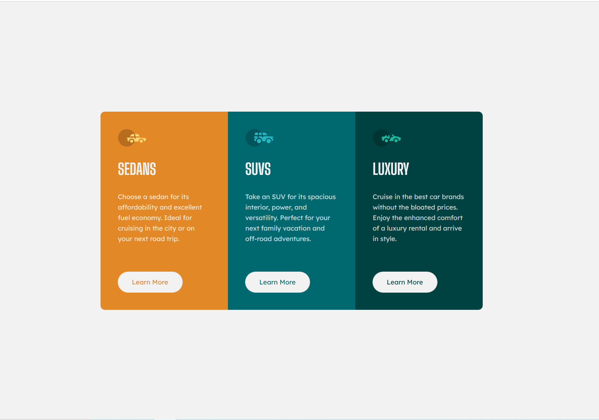

# Frontend Mentor - 3-column preview card component solution

## Table of contents

- [Overview](#overview)
  - [The challenge](#the-challenge)
  - [Screenshot](#screenshot)
  - [Links](#links)
- [My process](#my-process)
  - [Built with](#built-with)
  - [What I learned](#what-i-learned)
  - [Continued development](#continued-development)
  - [Useful resources](#useful-resources)

This is a solution to the [3-column preview card component challenge](https://www.frontendmentor.io/challenges/3column-preview-card-component-pH92eAR2-) on Frontend Mentor.

## Overview

### The challenge

Users should be able to:

- View the optimal layout depending on their device's screen size
- See hover states for interactive elements

### Screenshot



### Links

- Solution URL -  [GitHub repository](https://github.com/dostonnabotov/frontendmentor/)
- Live Preview URL - [Live Site](https://dostonnabotov.github.io/frontendmentor/)

## My process

### Built with

- Semantic HTML5 markup
- CSS custom properties
- CSS Grid
- Mobile-first workflow

### What I learned


As icons do not serve any purpose in explaining, I found out from other developers that leaving `alt` tag is a good option. However, Kevin Powell pointed out that some browsers can still read out it as image. So, he recommended to use `aria-hidden` to ensure that it cannot be accessed through screen readers.

```html

```

Easily change background color with custom properties.

```css
.card {
  background-color: var(--clr-card);
}

.card--1 { 
  --clr-card: #06f; 
}
```


### Continued development

In the near future, I would like to add some interactivity with JavaScript. For example, expanding cards when 'learn more' button is clicked and giving more information about a particular type. Therefore, I decided to make 'learn more' button rather than link.

### Useful resources

- [CUBE CSS](https://cube.fyi/)