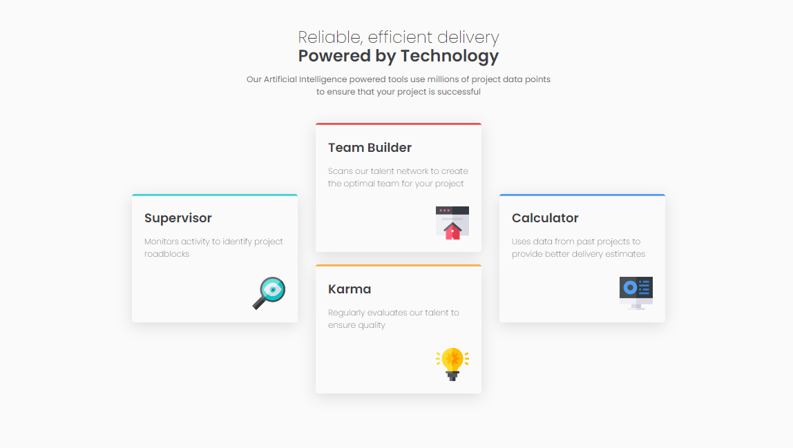

# Frontend Mentor - 4 Card Feature Section

## Table of contents

- [Overview](#overview)
  - [The challenge](#the-challenge)
  - [Screenshot](#screenshot)
  - [Links](#links)
- [My process](#my-process)
  - [Built with](#built-with)
  - [What I learned](#what-i-learned)

This is a solution to the [Four card feature section challenge](https://www.frontendmentor.io/challenges/four-card-feature-section-weK1eFYK) on Frontend Mentor.

## Overview

### The challenge

Users should be able to:

- View the optimal layout for the site depending on their device's screen size

### Screenshot



### Links

- Solution URL -  [GitHub repository](https://github.com/dostonnabotov/frontendmentor/tree/main/4-card-feature-section)
- Live Preview URL - [Live Site](https://dostonnabotov.github.io/frontendmentor/4-card-feature-section/)

## My process

### Built with

- Semantic HTML5 markup
- CSS custom properties
- CSS Grid
- Mobile-first workflow

### What I learned

Ensure a screen reader doesn't have access to icons that do not serve purpose

```html

```

Trick with custom properties to avoid repitition

```css
.card {
  border-top: 5px solid var(--_card-br-color);
}

.card:nth-child(1) {
  --_card-br-color: var(--clr-cyan);
}
```
