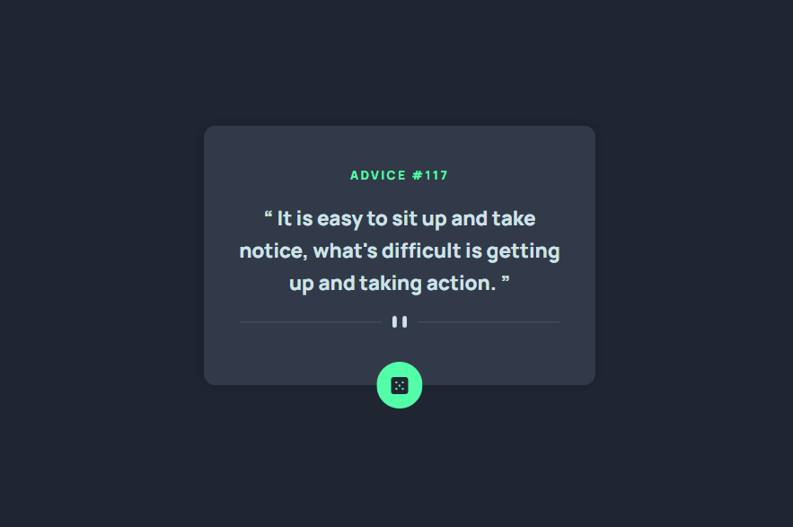

# Frontend Mentor - Advice Generator

## Table of contents

- [Overview](#overview)
  - [The challenge](#the-challenge)
  - [Screenshot](#screenshot)
  - [Links](#links)
- [My process](#my-process)
  - [Built with](#built-with)
  - [What I learned](#what-i-learned)
  - [Useful resources](#useful-resources)
- [Author](#author)

## Overview

This is a solution to the [Advice Generator](https://www.frontendmentor.io/challenges/advice-generator-app-QdUG-13db) on Frontend Mentor.

### The challenge

Users should be able to:

- View the optimal layout for the site depending on their device's screen size

### Screenshot



### Links

- Solution URL -  [GitHub repository](/*GITHUB URL*/)
- Live Preview URL - [Live Site](/*LIVE PREVIEW URL*/)

## My process

### Built with

- Semantic HTML5 markup
- CSS custom properties
- CSS Grid
- Mobile-first workflow

### What I learned

Use this section to recap over some of your major learnings while working through this project. Writing these out and providing code samples of areas you want to highlight is a great way to reinforce your own knowledge.

Here are some things I learned and am proud of:

```html
<picture>
  <source srcset="large-image.png" media="(min-width: 900px)" />
  <source srcset="small-image.png" media="(min-width: 400px)" />
  
</picture>
```

```css
.btn:is(:hover, :focus-visible) {
  /* something goes here */
}
```

### Useful resources

- [source and picture](https://developer.mozilla.org/en-US/docs/Web/HTML/Element/source) - A great way to set different images depending on different screen resolutions.

## Author

- Website - [Doston Nabotov](https://www.dostonnabotov.netlify.com)
- Frontend Mentor - [@dostonnabotov](https://www.frontendmentor.io/profile/dostonnabotov)
- Twitter - [@dostonnabotov](https://www.twitter.com/doston_nabotov)
