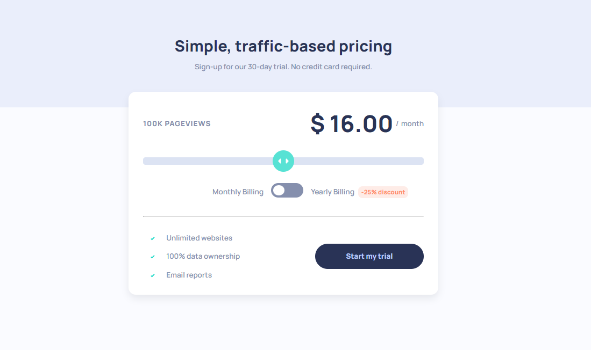

# Frontend Mentor - Interactive Pricing Component

## Table of contents

- [Overview](#overview)
  - [The challenge](#the-challenge)
  - [Screenshot](#screenshot)
  - [Links](#links)
- [My process](#my-process)
  - [Built with](#built-with)
  - [What I learned](#what-i-learned)

This is a solution to the [Interactive pricing component challenge](https://www.frontendmentor.io/challenges/interactive-pricing-component-t0m8PIyY8) on Frontend Mentor.

## Overview

### The challenge

Users should be able to:

- View the optimal layout for the site depending on their device's screen size

Here are the different page view ranges and the corresponding monthly price totals:

- 10K pageviews / $8 per month
- 50K pageviews / $12 per month
- 100K pageviews / $16 per month
- 500k pageviews / $24 per month
- 1M pageviews / $36 per month

If the visitor switches the toggle to yearly billing, a 25% discount should be applied to all prices.

### Screenshot



### Links

- Solution URL -  [GitHub repository](https://github.com/dostonnabotov/frontendmentor/)
- Live Preview URL - [Live Site](https://dostonnabotov.github.io/frontendmentor/)

## My process

### Built with

- Semantic HTML5 markup
- SCSS
- JavaScript
- Mobile-first workflow

### What I learned

grouping related classes

```html
<div class="[ card ] [ flow ]"></div>
```

A few tricks with scss

```scss
// clamp()
$fs-700: clamp(min, average, max);

// max()
.example {
  padding: max(4rem, 10vw);
}
```

Practiced `switch` statement

```js
switch (value) {
  case '1':
    // do something
    break;
  default:
    break;
}
```
