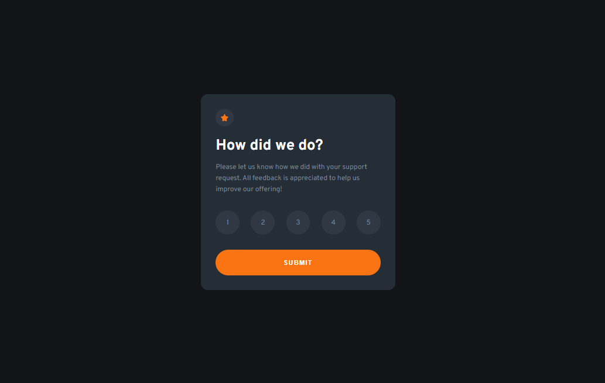

# Frontend Mentor - Interactive Rating Component

## Table of contents

- [Overview](#overview)
  - [The challenge](#the-challenge)
  - [Screenshot](#screenshot)
  - [Links](#links)
- [My process](#my-process)
  - [Built with](#built-with)
  - [What I learned](#what-i-learned)
  - [Continued development](#continued-development)

This is a solution to the [Interactive rating component challenge](https://www.frontendmentor.io/challenges/interactive-rating-component-koxpeBUmI) on Frontend Mentor.

## Overview

### The challenge

Users should be able to:

- View the optimal layout for the site depending on their device's screen size

### Screenshot



### Links

- Solution URL -  [GitHub repository](https://github.com/dostonnabotov/frontendmentor/)
- Live Preview URL - [Live Site](https://dostonnabotov.github.io/frontendmentor/)

## My process

### Built with

- Semantic HTML5 markup
- CSS custom properties
- CUBE CSS
- JavaScript
- Mobile-first workflow

### What I learned

- focusing heavily on `a11y` part
- implemented `CUBE` CSS
- used input `type="radio"` for rating scores
- `data` attribute for styling
- and, more...

```html
<!-- ensure that screen reader reads out the text rather than bunch of numbers -->
<span class="sr-only">Very Satisfied</span>

<!-- ensure that screen reader doesn't read out the numbers as it might confuse the user -->
<span aria-hidden="true">1</span>
```


```css
/* working with data attributes */
.btn[data-type="primary"] {
  display: inline-block;
}

/* :is() new css selector to avoid repition */
.btn:is(:hover, :focus-visible) {
  color: #222;
}

/* give the user a clicked satisfaction */
button:active,
.btn:active {
  transform: scale(0.97);
}
```


### Continued development

I implemented this solution in one page. I used `.hide` to show a new card and remove an old one when the form is submitted. I am wondering how it will impact in terms of a11y. I did my best to ensure that the site is accessible and user-friendly. 

However, I would love to hear some feedback on how to improve and make it even better in terms of a11y, design and consistency.
