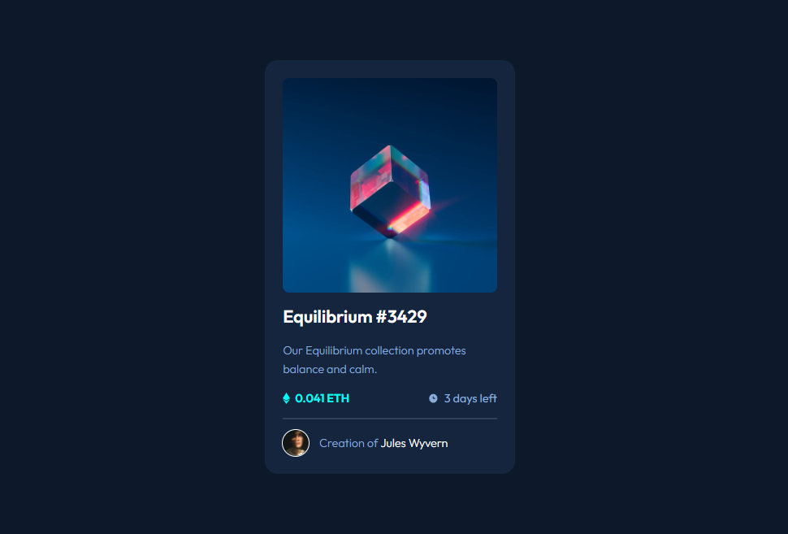

# Frontend Mentor - NFT preview card component

## Table of contents

- [Overview](#overview)
  - [The challenge](#the-challenge)
  - [Screenshot](#screenshot)
  - [Links](#links)
- [My process](#my-process)
  - [Built with](#built-with)
  - [What I learned](#what-i-learned)

This is a solution to the [NFT preview card component challenge](https://www.frontendmentor.io/challenges/nft-preview-card-component-SbdUL_w0U) on Frontend Mentor.

## Overview

### The challenge

Users should be able to:

- View the optimal layout for the site depending on their device's screen size
- See hover states

### Screenshots

### Links

- Solution URL -  [GitHub repository](https://github.com/dostonnabotov/frontendmentor/)
- Live Preview URL - [Live Site](https://dostonnabotov.github.io/frontendmentor/)

## My process

### Built with

- Semantic HTML5 markup
- CSS custom properties

### What I learned

Used pseudo elements `::before` and `::after` for background images on hover

