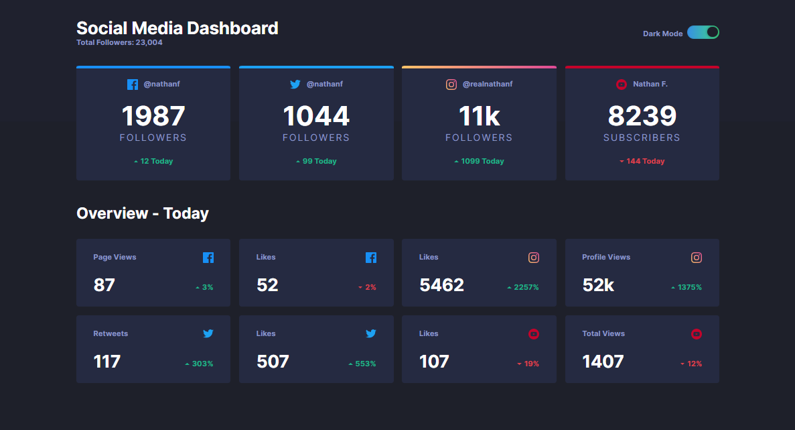

# Frontend Mentor - Social Media Dashboard

## Table of contents

- [Overview](#overview)
  - [The challenge](#the-challenge)
  - [Screenshot](#screenshot)
  - [Links](#links)
- [My process](#my-process)
  - [Built with](#built-with)
  - [What I learned](#what-i-learned)
  - [Continued development](#continued-development)
- [Acknowledgments](#acknowledgments)

This is a solution to the [Social media dashboard with theme switcher challenge](https://www.frontendmentor.io/challenges/social-media-dashboard-with-theme-switcher-6oY8ozp_H) on Frontend Mentor.
## Overview

### The challenge

Users should be able to:

- View the optimal layout for the site depending on their device's screen size

### Screenshot

### Links

- Solution URL -  [GitHub repository](https://github.com/dostonnabotov/frontendmentor/tree/main/social-media-dashboard)
- Live Preview URL - [Live Site](https://dostonnabotov.github.io/frontendmentor/social-media-dashboard/)

## My process

### Built with

- Semantic HTML5 markup
- Sass
- JavaScript
- mobile-first workflow

### What I learned

At first, I implemented this project in just HTML.

Then, later on, I used `template` tag in HTML and rendered the data through JavaScript. Despite it worked fine as I expected, browser support for `template` made to rethink other possible solutions. 

And, last, but not least I saved the data in JSON and rendered to the browser with `map()`. It went quite well. However, I used JSON only for *Overview* section where 8 cards needed to be rendered. I didn't use JSON for 4 cards above *Overview* section. Becuase I thought it would still output HTML at the end of day. However, as the project grows, I will implemented that in JSON, too or think about other optimal solutions...

### Continued development

I want to expand this project even more. This is just design. In the future, I would like to add functionality in which it will actually track user's information on social media. Also, adding some features, like how much time the user spent on Facebook or Twitter would be a great idea.

## Acknowledgments

- [Theme Switcher Functionality](https://www.youtube.com/watch?v=wodWDIdV9BY&t=884s) - Kevin Powell
