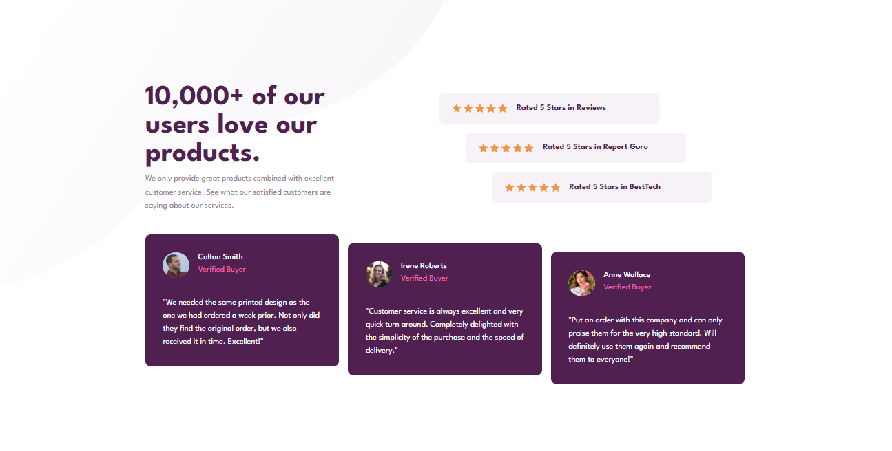

# Frontend Mentor - Social Proof Section

## Table of contents

- [Overview](#overview)
  - [The challenge](#the-challenge)
  - [Screenshot](#screenshot)
  - [Links](#links)
- [My process](#my-process)
  - [Built with](#built-with)

This is a solution to the [Social Proof Section](https://www.frontendmentor.io/challenges/social-proof-section-6e0qTv_bA) on Frontend Mentor.

## Overview

### The challenge

Users should be able to:

- View the optimal layout for the site depending on their device's screen size

### Screenshot

### Links

- Solution URL -  [GitHub repository](https://github.com/dostonnabotov/frontendmentor/tree/main/social-proof-section)
- Live Preview URL - [Live Site](https://dostonnabotov.github.io/frontendmentor/social-proof-section/)

## My process

### Built with

- Semantic HTML5 markup
- CSS custom properties
- Flexbox
- CSS Grid
- Mobile-first workflow

